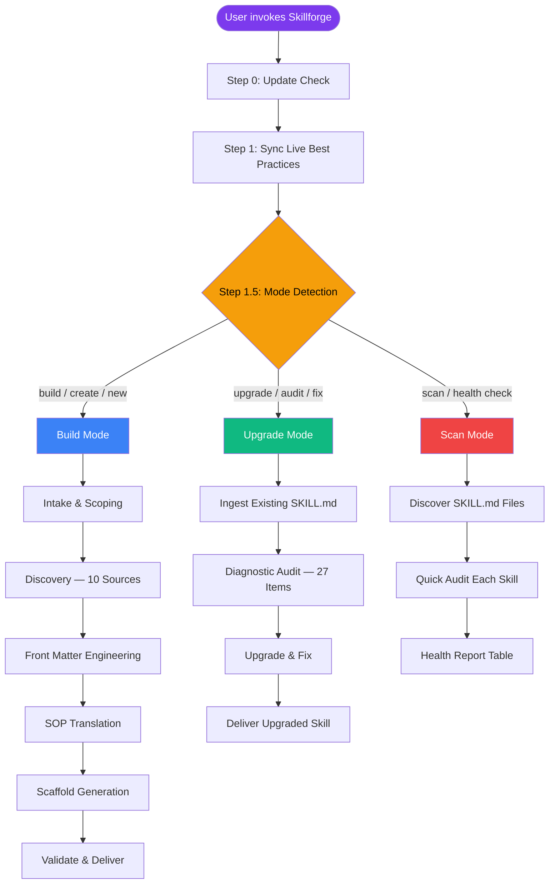
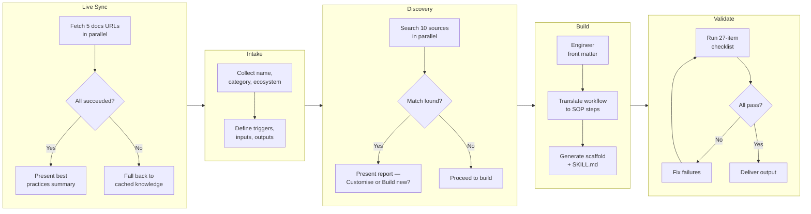
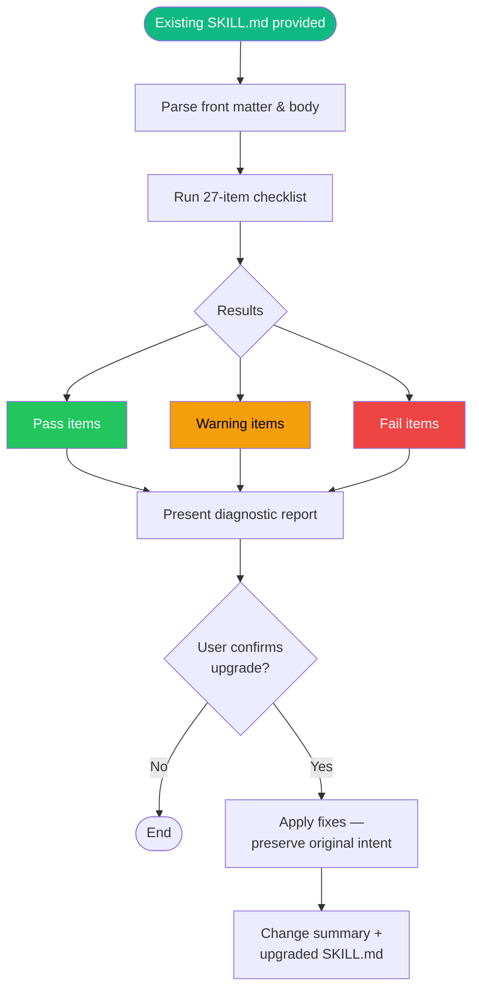
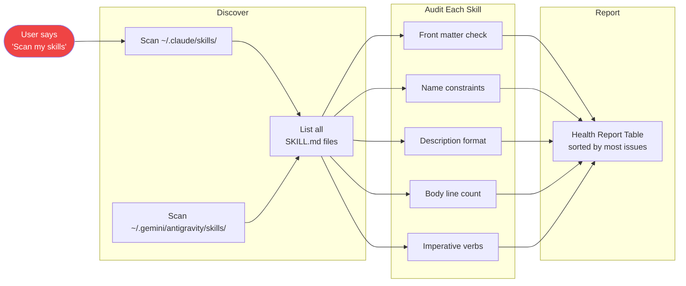
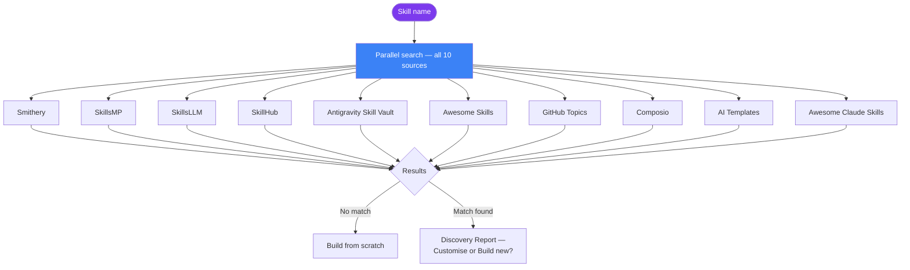
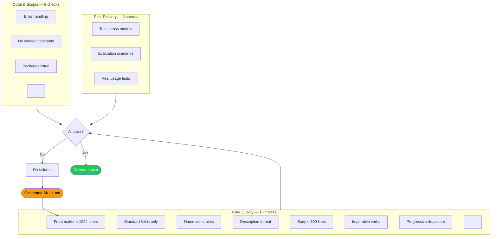

<div align="center">

# Claude Code Skillforge

### The skill that builds, upgrades, and scans skills.

Generate and upgrade Claude Code &amp; Antigravity `SKILL.md` files — with live best practices sync, 10-marketplace discovery, built-in skill upgrader, and self-validation — in minutes.

[](LICENSE)
[](CHANGELOG.md)
[](https://code.claude.com)
[](https://antigravity.google)

**Built by [Lijin Nair](https://lijinnair.com)** · [@lijinnair](https://github.com/lijinnair)

</div>

---

## Quick Start

```bash
# Clone into your Antigravity skills directory
git clone https://github.com/lijinnair/claude-code-skillforge ~/.gemini/antigravity/skills/claude-code-skillforge

# Or into native Claude Code
git clone https://github.com/lijinnair/claude-code-skillforge ~/.claude/skills/claude-code-skillforge
```

Then say: **"Build a new skill"**, **"Upgrade this skill"**, or **"Scan my skills"** — or run **`/claude-code-skillforge`**

---

## What It Does

Claude Code Skillforge is a meta-skill that builds, upgrades, and scans Claude Code and Antigravity skills. Give it a raw idea, messy workflow, or an existing skill to upgrade, and it outputs a deploy-ready `SKILL.md` file that follows every official best practice.

**Three modes** — all start with a live best practices sync, then branch:

**Build Mode** — "Build a new skill":

| Step | What happens |
|---:|---|
| 1 | **Live Best Practices Sync** — Fetches latest rules from `code.claude.com` and `antigravity.google` |
| 2 | **Intake** — Collects your skill name, category, ecosystem, triggers, inputs, and outputs |
| 3 | **Discovery** — Searches 10 marketplaces in parallel to find existing similar skills |
| 4 | **Front Matter** — Engineers a spec-compliant, sub-1024-char metadata block |
| 5 | **SOP Translation** — Converts your workflow into an imperative execution pipeline |
| 6 | **Self-Validation** — Audits its own output against a 27-item, 3-section checklist before delivery |

**Upgrade Mode** — "Upgrade this skill":

| Step | What happens |
|---:|---|
| U1 | **Ingest** — Reads and parses the existing SKILL.md |
| U2 | **Diagnostic Audit** — Runs 27-item checklist, reports Pass/Warning/Fail per item |
| U3 | **Upgrade & Fix** — Applies all fixes while preserving original intent |
| U4 | **Deliver** — Change summary + upgraded SKILL.md |

**Scan Mode** — "Scan my skills":

| Step | What happens |
|---:|---|
| S1 | **Discover** — Finds all SKILL.md files in your skills directories |
| S2 | **Quick Audit** — Runs key checks on each skill |
| S3 | **Health Report** — Outputs a table sorted by most issues first |

## How It Works

### High-Level Architecture



### Build Mode — Full Pipeline



### Upgrade Mode — Diagnostic & Fix



### Scan Mode — Health Check



### 10-Source Discovery — Parallel Search



### Self-Validation Checklist



---

## Why It Exists

Most Claude Code and Antigravity skills are written like essays. Claude Code Skillforge enforces **Progressive Disclosure** — the principle that every token in the context window must earn its place:

- Minimal footprint in the context window
- Deterministic logic offloaded to `scripts/`
- Examples and references loaded only when needed
- Strict imperative pipelines, not conversational prose

The result: skills that are faster, more reliable, and cheaper to run.

## Features

- **Dual ecosystem** — Generates skills for Claude Code or Antigravity
- **Live best practices sync** — Always builds against the latest official spec
- **Skill upgrader** — Feed it any existing SKILL.md and get a diagnostic audit + automated upgrade to latest best practices
- **Skill scanner** — Say "Scan my skills" to audit all installed skills at once and get a health report table with issues ranked by severity
- **10-source discovery** — Searches Smithery, SkillsMP, SkillsLLM, SkillHub, Composio, AI Templates, GitHub Topics, Awesome Claude Skills, and more before building from scratch
- **Graceful fallback** — If docs are unreachable, surfaces cached version and asks before proceeding
- **Self-validating** — 27-item, 3-section checklist (Core quality, Code & scripts, Post-delivery) catches errors before you see the output
- **Pattern library** — Teaches 8 authoring patterns: degrees of freedom, feedback loops, templates, examples, conditional workflows, checklists, verifiable intermediates, defaults over options
- **Evaluation-ready** — Ships with 5 evaluation scenarios covering Build, Upgrade, and Scan modes
- **Token-optimized** — The skill itself practices what it preaches (< 250 lines, ~1,800 tokens)
- **Self-updating** — Checks for newer versions on GitHub before every run, with a one-line update notice

## Repository Structure

```
claude-code-skillforge/
├── SKILL.md            ← The core SOP (v5.10.0)
├── VERSION             ← Current version string (used by self-update)
├── README.md           ← You are here
├── CHANGELOG.md        ← Full version history
├── CONTRIBUTING.md     ← How to contribute
├── LICENSE             ← MIT
├── skill.json          ← Marketplace metadata
├── examples/
│   ├── auditing-seo/SKILL.md
│   ├── formatting-commits/SKILL.md
│   ├── sample-upgrade-report.md
│   └── sample-scan-report.md
└── evaluations/
    ├── eval-simple-skill.json
    ├── eval-skill-with-scripts.json
    ├── eval-advanced-skill.json
    ├── eval-upgrade-mode.json
    └── eval-scan-mode.json
```

## Examples

**Build Mode** outputs:

- **[Auditing SEO](examples/auditing-seo/SKILL.md)** — Audits any URL for title tags, meta descriptions, heading structure, and content quality
- **[Formatting Commits](examples/formatting-commits/SKILL.md)** — Generates Conventional Commits messages from staged diffs

**Upgrade & Scan Mode** outputs:

- **[Sample Upgrade Report](examples/sample-upgrade-report.md)** — Diagnostic audit with Pass/Warning/Fail + change summary
- **[Sample Scan Report](examples/sample-scan-report.md)** — Health report table across all installed skills

## Contributing

See [CONTRIBUTING.md](CONTRIBUTING.md). All contributions welcome.

## Author

**[Lijin Nair](https://lijinnair.com)** — AI Systems Builder &amp; Prompt Architect

- GitHub: [@lijinnair](https://github.com/lijinnair)
- Web: [lijinnair.com](https://lijinnair.com)

---

<div align="center">

If Claude Code Skillforge saved you time, **[star the repo](https://github.com/lijinnair/claude-code-skillforge)** — it helps others find it.

</div>
